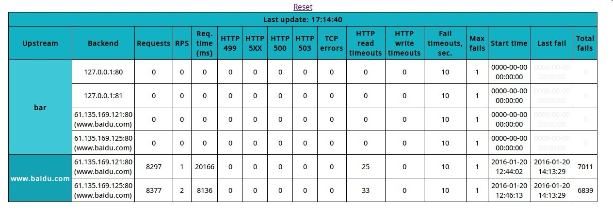

nginx-ustats-module
============

# Provides basic statistics for each nginx upstream backend:

* Number of requests
* Http 499/500/503 errors count
* Tcp errors
* Http read/write timeouts
* Fail timeout
* Max fails count
* Last failed access time
* Total fails count
* Blacklisted backend highlighting
* Down backends highlighting

The module's **web interface** provides a good visual representation of what's going on with your backends. Values in some columns of the table can be sorted within each upstream row.

Gathered data is available in **JSON format** with `?json=1` in request url.

_Example:_ `http://127.0.0.1:8045/monitor?json=1 `

```json
{
    "bar":
    [
        ["127.0.0.1:80", 0, 0, 0, 0, 0, 0, 0, 0, 0, 0, 0, 0, 10, 1, "0000-00-00 00:00:00", "0000-00-00 00:00:00", 0],
        ["127.0.0.1:81", 0, 0, 0, 0, 0, 0, 0, 0, 0, 0, 0, 0, 10, 1, "0000-00-00 00:00:00", "0000-00-00 00:00:00", 0],
        ["61.135.169.121:80 (www.baidu.com)", 0, 0, 0, 0, 0, 0, 0, 0, 0, 0, 0, 0, 10, 1, "0000-00-00 00:00:00", "0000-00-00 00:00:00", 0],
        ["61.135.169.125:80 (www.baidu.com)", 0, 0, 0, 0, 0, 0, 0, 0, 0, 0, 0, 0, 10, 1, "0000-00-00 00:00:00", "0000-00-00 00:00:00", 0],
        0
    ],
    "www.baidu.com":
    [
        ["61.135.169.121:80 (www.baidu.com)", 0, 1, 8296, 1, 60401, 0, 0, 0, 0, 0, 20, 0, 10, 1, "2016-01-20 12:44:02", "2016-01-20 14:13:22", 7003],
        ["61.135.169.125:80 (www.baidu.com)", 0, 1, 8375, 1, 360, 0, 0, 0, 0, 0, 24, 0, 10, 1, "2016-01-20 12:46:13", "2016-01-20 14:13:23", 6826],
        1
    ]
}
```

```json
{
	upstream name:
	[
	    [peer_name, down, failed, requests, RPS, SPEED, 499, 5xx, 500, 503, tcp_errors, R_timeouts, w_timeouts, f_t, m_f, s_t, last_fail_t, tot_f],
	implicit
	]
}
```

`implicit`: means different upstream (if implicit 1 means 'implicit' upstream for example `proxy_pass`).

5xx:  499 < x < 600 explict 500 503
* Html Show
request url:
`http://127.0.0.1:8045/monitor?json=1 `



* Note
 `this module not support `dynamic manage upstream` forexample 'tengine dyups module'.`

#### TODO
* support `dyups` module.


#### Installation

* tested with tengine-2.1.1
Copy `nginx-1.6.2.patch` file into nginx root folder
cd into nginx root folder and apply the patch:

    patch -p1 -i nginx-1.6.2.patch

Run ./configure with all parameters you normally use, appending option

    --add-module=src/http/modules/ngx_ustats_module
    make && make install


#### Configuration

*Example*

    location /ustats {
        ustats memsize=3m;
        ustats_refresh_interval 6000;
        ustats_html_table_width 95;
        ustats_html_table_height 95;
    }

# Directives
## ustats

| Syntax                  | `ustats memsize=4m`             |
| :---------------------- | :------------------------------ |
| Default                 | --                              |
| Context                 | `location`                      |

Enables module handler for this location and sets the size of the shared memory that will be used to store statistics data across all worker processes.

Example: `ustats memsize=2m;`

## ustats_html_table_width

| Syntax                  | `ustats_html_table_width n`     |
| :---------------------- | :------------------------------ |
| Default                 | `70`                            |
| Context                 | `location`                      |

Specifies web interface table width. Values less or equal to 100 are interpreted as percents, otherwise as pixels.

## ustats_html_table_height

| Syntax                  | `ustats_html_table_height n`    |
| :---------------------- | :------------------------------ |
| Default                 | `70`                            |
| Context                 | `location`                      |

Specifies web interface table height. Values less or equal to 100 are interpreted as percents, otherwise as pixels.


## ustats_refresh_interval

| Syntax                  | `ustats_refresh_interval n`     |
| :---------------------- | :------------------------------ |
| Default                 | `5000`                          |
| Context                 | `location`                      |

Specifies page refresh interval in milliseconds.
